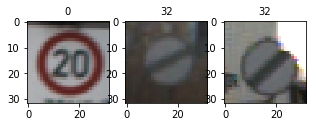

## Project: Traffic Sign Recognition Program

---
The goals / steps of this project are the following:
* Load the data set
* Explore, summarize and visualize the data set
* Design, train and test a model architecture
* Use the model to make predictions on new images
* Analyze the softmax probabilities of the new images
* Summarize the results with a written report

### Dependencies
This lab requires:

* [CarND Term1 Starter Kit](https://github.com/udacity/CarND-Term1-Starter-Kit)

The lab environment can be created with CarND Term1 Starter Kit. Click [here](https://github.com/udacity/CarND-Term1-Starter-Kit/blob/master/README.md) for the details.

# Project References
---
* Project notebook  [Traffic_Sign_Classifier.ipynb]
* Code-export [report.html]
* signnames.csv [signnames.csv]

[Traffic_Sign_Classifier.ipynb]: Traffic_Sign_Classifier.ipynb
[report.html]: report.html
[signnames.csv]: signnames.csv

# Data Summary and exploration
---
I used the pickle module to load the train, test and validation datasets. The dataset contains images already scaled to 32x32 size. Then calculated the dataset properties as below

Number of training examples = 34799

Number of testing examples = 12630

Image data shape = (32, 32, 3)

Number of classes = 43

The Example dataset is as below:

 

Here is an exploratory visualization of the data set. It is a bar chart showing how the data ...

 

# Design and Test a Model Architecture
---
Used the LeNet architecture. This architecture accepts a 32x32x3 images and then passes them to a series of convolution layers and pooling layers and obtains a 5x5x16 shaped feature maps. The features are then flattened and then passed over to a fully connected layers which predicts the correct class of the image

Here is the LeNet architecture in detail

 

I have experimented on the learning rate parameter in the range 0.001 to 0.01 and the validation accuracy seems to consistent with a very less variation so used the standard learning rate of 0.001.

I have used the technique of early stop by checking the validation accuracy and saved the model each time accuracy increased. So obtained a model with accuracy **94.57%** with learning rate 0.003 at epoch 36

# Testing a Model
---
I have tested the model with the test data set and obtained a 92.06% accuracy

# Testing a Model on Images downloaded from the web
---
I have browsed over the internet and found a few of them and downloaded them over to the "webimages/" folder.

The images are as below when they are downsized to 32x32x3

 

The Images when they are normalized, and gray scaled

 

I stacked all the images to an array **batch** so they can be passed into the evaluate function to obtain the class labels

# Testing the web images
---
The classifier has obtained an 80% accuracy classifying the images. The list of the top 5 labels given by the classifier are as below:

 
 
 
 
 

The first four images are classified properly while the classifier failed to classify the speed limit (60km/h) sign board correctly and it ranked it at the second highest probability

# Improvements
---
The model struggles to classify images with a lot of background noise so the training data is to be added with the images in different noises and directions so it learns better